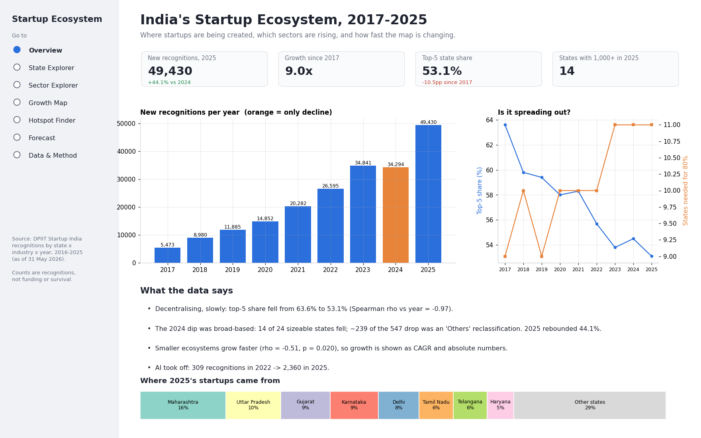
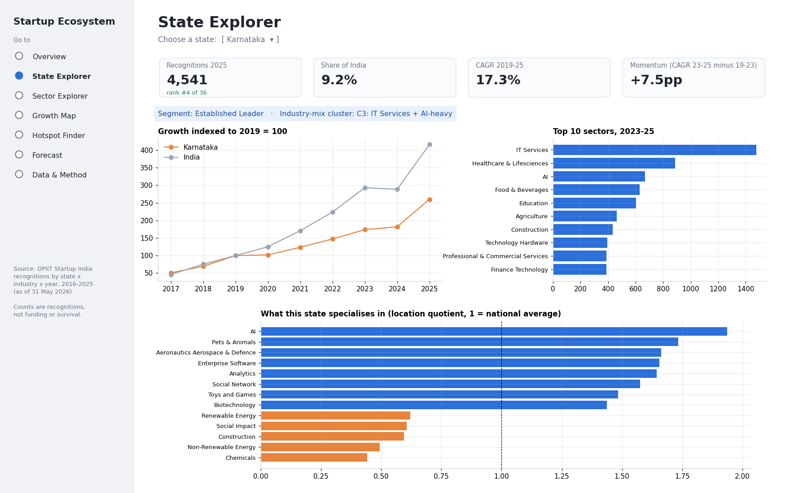
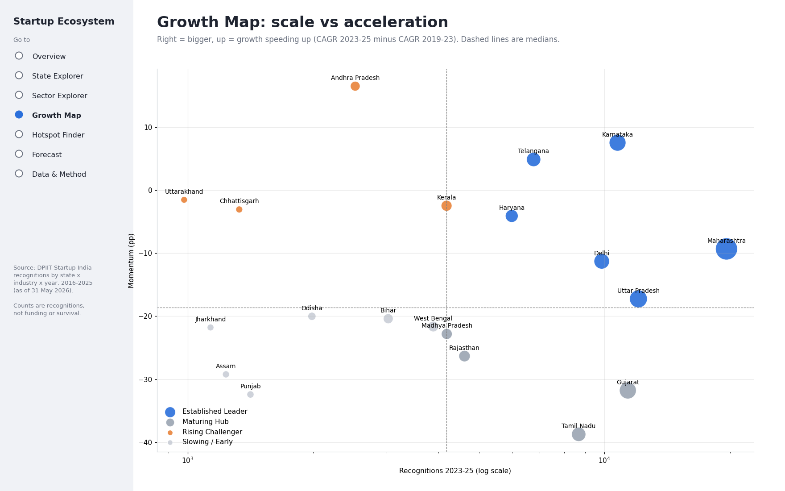
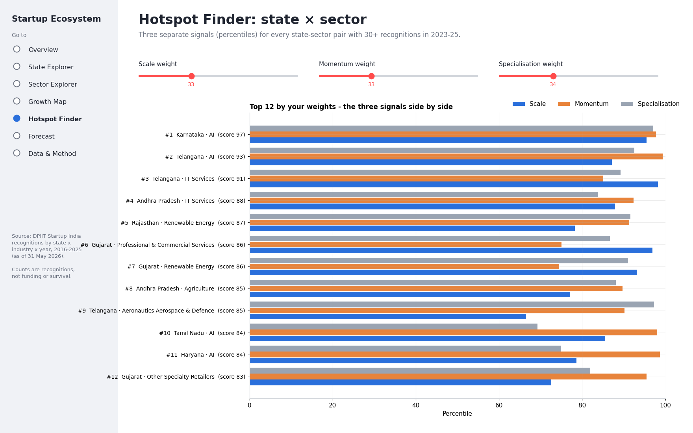
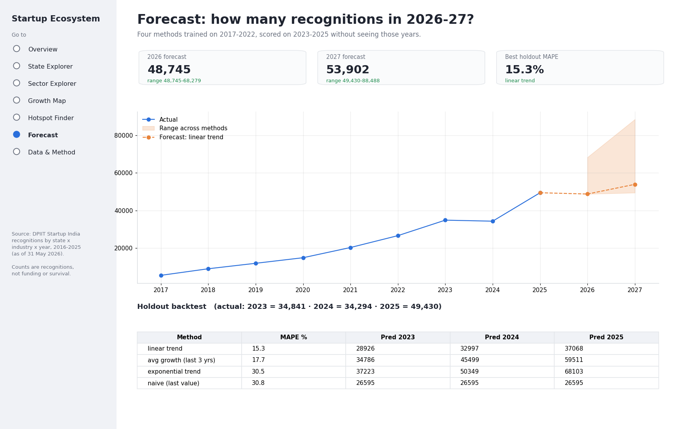

# Indian Startup Ecosystem Analytics

An end-to-end data analytics project on 207K+ DPIIT startup recognitions (2016–2025) that finds where India's startups are growing, which sectors are rising, and which state × sector pairs are emerging hotspots. It includes a 7-page interactive Streamlit dashboard.

**Tools:** Python (pandas, NumPy, SciPy, scikit-learn), SQL (SQLite), Matplotlib, Plotly, Streamlit

---

## 1. Problem Statement

India's startup ecosystem has grown fast since the Startup India scheme launched in 2016, but the growth isn't even across states or sectors. This project answers five questions:

1. How fast has the ecosystem grown, and was that growth steady?
2. Is it still concentrated in a few states, or spreading out?
3. Which states are growing fastest, and is their growth speeding up or slowing down?
4. Which sectors are gaining share, and where are they concentrated?
5. Which state × sector combinations are the strongest emerging hotspots?

## 2. Dataset

| Item | Detail |
|---|---|
| Source | DPIIT (Department for Promotion of Industry and Internal Trade), Startup India |
| Coverage | 2016–2025 (data as of 31 May 2026) |
| Granularity | Year × State × Industry |
| Size | 9,932 rows · 36 States/UTs · 56 industries · 207,134 recognitions |
| Measure | Number of startups recognised by DPIIT |

**Note:** a recognition means a startup registered with the government scheme. It does not measure funding, revenue or survival.

## 3. Project Workflow

### Step 1: Data Audit
- Checked row counts, year range, duplicates, nulls and the minimum value of every column.
- Found that the raw file only lists state-industry-year combinations with at least 1 startup, so missing combinations are real zeros.
- Flagged 2016 as a partial launch year (502 recognitions vs 5,473 in 2017).
- Found that the "Others" category collapses from 240 to 1 in 2024. That's a category relabelling, not a real decline.

### Step 2: Data Cleaning and Transformation
- Standardised column names, state names and industry labels.
- Built a complete **state × industry × year panel** by zero-filling missing combinations: 9,932 → 20,160 rows.
- Left 2016 out of all growth calculations, and required a minimum base of 50 before computing a state's CAGR.

### Step 3: SQL Analysis
Loaded the clean panel into a **SQLite** database and wrote five analytical queries:
- Year-over-year national growth (`LAG`)
- State rankings and shares each year (`RANK`, windowed `SUM`)
- Cumulative startups per state (running totals)
- Sector share shift from 2019 to 2025 (conditional aggregation with CTEs)
- Each state's top sector (`ROW_NUMBER`)

### Step 4: Exploratory and Trend Analysis
- National growth trend and a breakdown of the 2024 dip by state and sector.
- Sector trends, including deep-tech (AI, Robotics, Biotech, IoT).

### Step 5: Geographic Concentration Analysis
- Measured concentration each year with the **Herfindahl-Hirschman Index (HHI)**, the top-5 state share, and how many states it takes to reach 80% of startups.
- Tested whether concentration is falling over time with a **Spearman correlation**.

### Step 6: State Growth and Segmentation
- Measured growth three ways: **CAGR**, **absolute growth**, and **momentum** (recent CAGR minus earlier CAGR).
- Split states into four segments by scale and momentum: Established Leader, Maturing Hub, Rising Challenger, Slowing / Early.
- Tested whether smaller ecosystems grow faster with a Spearman correlation between base size and CAGR.

### Step 7: Sector Specialisation and Clustering
- Calculated a **Location Quotient (LQ)** for every state-sector pair to show which states over-index in which sectors.
- Grouped states by their industry mix using **KMeans clustering**, choosing the number of clusters by silhouette score.

### Step 8: Hotspot Scoring
- Scored every state × sector pair on three percentile signals: **scale**, **momentum** and **specialisation (LQ)**.
- Kept the three signals visible instead of hiding them in one score. Users set the weights in the dashboard.
- Ran a **weight-sensitivity test** (5 weighting schemes) to check whether the top-20 list holds up.

### Step 9: Forecasting
- Compared **4 forecasting models** (naive, linear trend, exponential trend, average growth).
- Trained on 2017–2022 and tested on 2023–2025 without letting the models see those years, scoring each by **MAPE**.
- Refitted the best model (linear trend, **15.3% MAPE**) and projected 2026–27, with a range across all four models.

### Step 10: Dashboard
Built a **7-page Streamlit + Plotly dashboard** on the same analysis functions, so the dashboard and the report always show the same numbers.

## 4. Key Findings

| # | Finding | Evidence |
|---|---|---|
| 1 | The ecosystem grew **9x** | 5,473 (2017) → 49,430 (2025) recognitions |
| 2 | **2024 was the only decline**, and it was broad-based | −1.6%; 14 of 24 sizeable states fell; 2025 rebounded +44% |
| 3 | Startups are **spreading beyond the top states** | Top-5 share fell 63.6% → 53.1% (Spearman ρ = −0.97) |
| 4 | **Smaller ecosystems grow faster** | ρ = −0.51, p = 0.02 across 20 states |
| 5 | Growth rate and absolute growth rank states differently | Bihar leads on CAGR (43%/yr); Maharashtra leads on absolute growth (+5,838) |
| 6 | **AI is the fastest-rising sector** | 309 (2022) → 2,360 (2025); more concentrated than startups overall, with Karnataka holding 17.6% |
| 7 | Top hotspots | Karnataka·AI, Telangana·AI, Telangana·IT Services, Andhra Pradesh·IT Services, Rajasthan·Renewable Energy |
| 8 | 2026 projection | ~48.7K–68.3K recognitions (range across the four models) |

## 5. Dashboard

The dashboard has seven pages: Overview, State Explorer, Sector Explorer, Growth Map, Hotspot Finder, Forecast, and Data & Method.

The images below are static previews of five of the pages, made from the same data with `render_dashboard_preview.py`. For live screenshots, run the app and capture each page.

**Overview:** KPIs, yearly trend, concentration trend, key insights


**State Explorer:** state KPIs, growth vs India, top sectors, specialisation


**Growth Map:** state segments by scale vs momentum


**Hotspot Finder:** adjustable weights, state × sector ranking


**Forecast:** model backtest and 2026–27 projection


## 6. Project Structure

```
startup-ecosystem-analytics/
├── startup_analysis.py           # full pipeline: audit → clean → SQL → analysis → charts → report
├── dashboard.py                  # Streamlit dashboard (7 pages)
├── render_dashboard_preview.py   # generates the dashboard preview PNGs
├── requirements.txt
├── data/
│   ├── raw/                      # original DPIIT CSV
│   └── processed/                # clean panel CSV + SQLite database
└── outputs/
    ├── findings.md               # auto-generated findings report
    ├── figures/                  # 8 analysis charts
    ├── tables/                   # 15 result tables, including SQL outputs
    └── dashboard/                # dashboard preview images
```

## 7. How to Run

```bash
pip install -r requirements.txt
python startup_analysis.py     # runs the full analysis
streamlit run dashboard.py     # launches the dashboard
```

## 8. Skills Demonstrated

- **Data cleaning:** auditing, zero-filling a sparse panel, catching category changes
- **SQL:** CTEs, window functions (`LAG`, `RANK`, `ROW_NUMBER`, running totals), conditional aggregation
- **Statistics:** CAGR, HHI, Location Quotient, Spearman correlation, significance testing
- **Machine learning:** KMeans clustering with silhouette-based selection
- **Forecasting:** comparing models on a holdout period by MAPE
- **Visualisation and BI:** Matplotlib, Plotly, and an interactive Streamlit dashboard
- **Analytical judgement:** robustness checks and clearly stated limitations

## 9. Limitations

- Recognitions measure registrations, not funding, revenue or survival.
- Sector labels are self-reported, and the categories change over time.
- A startup's state is where it registered, which may not be where it operates.
- The KMeans clusters overlap (silhouette ≈ 0.21), so read them as rough groupings.
- Nine yearly data points is limited for forecasting, so projections are ranges.

## 10. Future Scope

- Add funding data (e.g., Tracxn or Inc42) to measure startup quality, not just volume.
- Add district-level data and an India map (choropleth).
- Deploy the dashboard on Streamlit Community Cloud.

---

## CV Entry

**Indian Startup Ecosystem Analytics | Python, SQL, Streamlit**
- Analysed 207K+ DPIIT startup recognitions across 36 States/UTs and 56 industries (2016–2025) to identify national, regional and sectoral growth trends.
- Transformed 9,932 raw records into a 20K-row state × industry × year panel and applied SQL window functions, CAGR, HHI, Location Quotient, Spearman correlation and KMeans clustering.
- Benchmarked 4 forecasting models on a 2023–25 holdout (best MAPE 15.3%) and built a 7-page Streamlit dashboard with 2026–27 projections.
